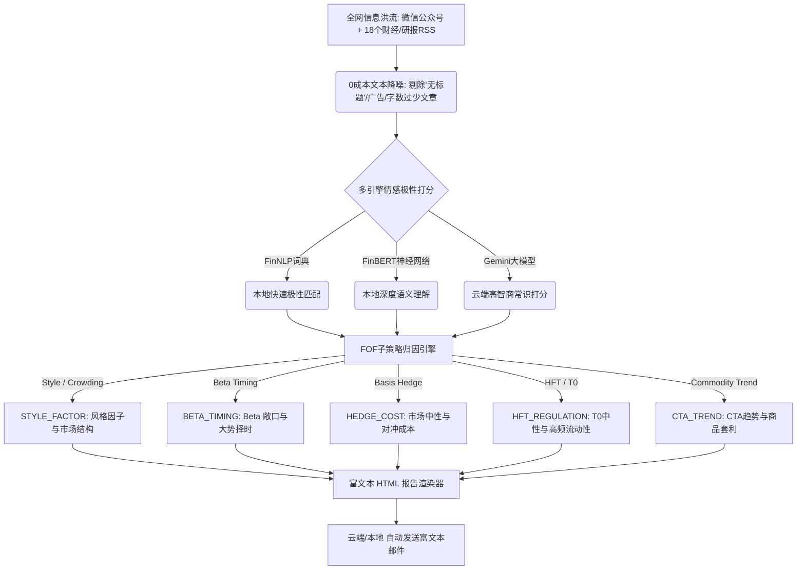

# 📡 阿尔法雷达系统 (Alpha Radar System)
> **私募量化 FOF 投资专属舆情归因与决策雷达流水线**

本项目是一个专为私募量化 FOF 投资经理设计的**独立量化舆情打分与策略归因系统**。它基于华安证券 AI 投研 Session 3 培训关于**阿尔法雷达系统**的底层设计哲学构建，旨在将海量非标信息降噪、归因并自动收敛为可直接下注或验证的“待验证投资假设草稿单”。

---

## 🎯 业务设计架构与传导链

本系统围绕量化 FOF 关注的核心子策略和风险因子，将舆情自动归类至以下 5 大归因模块：



### 1. 【市场结构与风格因子】 (`STYLE_FACTOR`)
*   **监控重点**：大小盘风格轮动（如沪深300 vs 中证1000/微盘股走势）、红利哑铃/方锥策略漂移、多因子/风格因子整体回撤及拥挤度警告。
*   **决策映射**：当小市值因子极度拥挤或微盘股流动性收紧时，警示指数增强策略子基金的 Alpha 超额收益回撤风险。

### 2. 【Beta 敞口与大势择时】 (`BETA_TIMING`)
*   **监控重点**：系统性杠杆风险、宏观流动性信用扩张/收缩（如央行降息/降准、LPR报价）、市场极端情绪（普跌/爆仓/强平压力）。
*   **决策映射**：辅助 FOF 决定是否临时暴露、收紧或套期保值 Beta 敞口。

### 3. 【市场中性与对冲基差】 (`HEDGE_COST`)
*   **监控重点**：股指期货（IC/IF/IM）基差贴水深度、分红贴水季节效应、移仓换月损耗，以及**雪球期权对冲盘**（密集敲入/敲出风险）与融券券源监管政策。
*   **决策映射**：防范基差贴水大幅波动和券源短缺对股票中性策略造成的“基差/超额双杀”。

### 4. 【T0中性与高频流动性】 (`HFT_REGULATION`)
*   **监控重点**：全市场成交量级（地量/巨量临界点）、盘中换手率、高频/程序化交易的监管风向以及大量化机构的异常行为（如封盘、规模巨变）。
*   **决策映射**：当成交量微缩或高频监管收紧时，预警 T0 中性策略子基金超额收益的压制。

### 5. 【CTA趋势与商品套利】 (`CTA_TREND`)
*   **监控重点**：大宗商品库存异动、地缘政治冲突对供应链的冲击（如中东局势、油轮袭击）。
*   **决策映射**：为复合 CTA、股指 CTA 或商品套利策略提供趋势强弱或跨期套利的仓位调配信号。

---

## 📂 项目结构与核心模块

```text
quant_sentiment_pipeline/
├── README.md               # 本说明文件
├── requirements.txt        # 项目依赖 (已补充 dolphindb 和 google-generativeai)
├── run_scheduler.sh        # 本地 Cron 调度脚本
├── config/
│   └── settings.json       # DolphinDB 内网参数与路径配置文件
├── data/
│   ├── fof_report.html     # 本地生成的富文本网页报告 (双击直接预览)
│   └── factors/
│       └── sentiment_factors_YYYYMM.csv  # 13列量化情绪因子数据表
├── src/
│   ├── pipeline.py         # 流水线主运行逻辑 (支持路径降级与 FOF 归因对接)
│   ├── engine/
│   │   ├── lexicon_model.py     # FinNLP 词典情感引擎
│   │   ├── bert_model.py        # FinBERT 本地神经网络引擎 (支持无环境降级)
│   │   ├── gemini_model.py      # Gemini 大模型引擎 (包含测试 Mock 模式)
│   │   └── fof_attribution.py   # 新增: 量化 FOF 专属归因与降噪引擎
│   ├── ingestion/
│   │   ├── ddb_extractor.py     # DolphinDB 事实表拉取器 (自选公众号)
│   │   └── rss_scraper.py       # 18路财经资讯/研报 RSS scraper
│   └── utils/
│       ├── pdf_parser.py        # 研报 PDF 前两页摘要解析器
│       └── send_email.py        # 新增: 格式化 HTML 投研报告邮件发送器
```

---

## 📊 因子数据表字段说明 (13列规范)

流水线输出的 CSV 因子格式与量化回测系统完全兼容：

| 字段名 | 类型 | 说明 |
| :--- | :--- | :--- |
| `timestamp` | string | 雷达扫描打分生成的时间戳 (`YYYY-MM-DD HH:mm:ss`) |
| `pub_date` | string | 资讯源原始发布时间 |
| `source` | string | 资讯来源渠道名称 (如: 微信公众号, 东方财富-策略, 富途要闻) |
| `title` | string | 资讯标题 |
| `link` | string | 原文链接（或研报 PDF 直链，供进一步追溯事实） |
| `score_finnlp` | float | 本地词典 (FinNLP) 打分值（区间 `[-1.0, 1.0]`） |
| `channel_finnlp` | string | 使用的词典语种分类通道 |
| `score_finbert` | float | 本地 BERT 预测极性差分值（区间 `[-1.0, 1.0]`，无环境时默认 0.0） |
| `channel_finbert` | string | 使用的本地 BERT 模型版本 |
| `score_gemini` | float | Gemini 模型情感极性值（区间 `[-1.0, 1.0]`） |
| `channel_gemini` | string | 使用的 Gemini 分类模式 (`Gemini-Mock` 或 `Gemini-API`) |
| `fof_strategy` | string | 归属的量化 FOF 子策略代码 (逗号分隔，如 `STYLE_FACTOR,ALPHA_CROWDING`) |
| `fof_keywords` | string | 命中的核心归因关键词 (逗号分隔，如 `微盘股,风格切换`) |

---

## ⚡ 快速开始与配置说明

### 1. 环境准备
确保您的本地虚拟环境已安装了基础 Python 环境并安装了相关依赖：
```bash
/Users/chievan/Documents/projects/private-fund-pro/venv/bin/pip install -r requirements.txt
```

### 2. GitHub Secrets 配置 (Actions 运行必备)
要在云端成功跑通大模型打分和邮件自动投递，必须在您的 GitHub 仓库中配置以下 5 个 **Repository Secrets**：
*   `GEMINI_API_KEY`：Google Gemini API 的授权密钥（用于实弹分析）。
*   `SMTP_SERVER`：发件邮箱服务器地址（如 `smtp.163.com`）。
*   `SMTP_PORT`：SSL 对冲发信端口（通常为 `465`）。
*   `MAIL_USERNAME`：发件邮箱地址。
*   `MAIL_PASSWORD`：发件邮箱的 **SMTP 第三方授权码**（非邮箱登录密码）。

### 3. 本地单次测试运行
```bash
cd /Users/chievan/Documents/projects/quant_sentiment_pipeline
/Users/chievan/Documents/projects/private-fund-pro/venv/bin/python src/pipeline.py
```

### 4. 本地网页报告预览
运行结束后，您可以直接在电脑上双击打开：
`data/fof_report.html` 
在浏览器中实时预览邮件报告的富文本视觉效果。

---

## 💡 下一步规划 (Session 4 对接)
雷达系统生成的量化 FOF 策略归因，是决策的前哨站。在 Session 4 中，我们将在此基础上构建 **“判断层工作流”**：
1. **状态机转移**：当 `HEDGE_COST`（基差对冲成本）或 `STYLE_FACTOR`（大小盘风格切换）的情感得分触发预设临界值时，自动触发相关管理人仓位评级降级。
2. **产业链数据校验**：自动联动 Tushare/AkShare 等量价指标，进行交叉验证，最终输出实盘可执行的下注指令。
