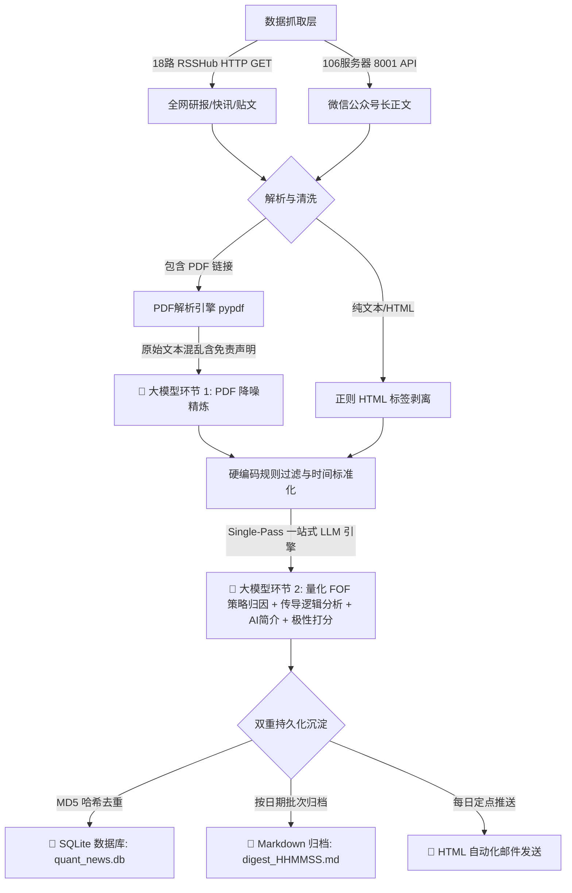

# 🏛️ 私募量化 FOF 舆情与研报大模型归因流水线说明文档

本文档说明了 `quant_sentiment_pipeline` 项目的全流程处理架构，重点说明 **“大模型驱动的五维量化 FOF 策略多维归因与传导逻辑分析”** 的技术实现。

---

## 🌐 第一部分：项目流水线架构 (Pipeline Architecture)

系统将全网 RSS 资讯、卖方 PDF 研报和微信公众号文章，转化为结构化的量化投研因子、大模型策略归因与 HTML 邮件/Markdown 报告。



---

## 🏛️ 第二部分：五维量化 FOF 策略归因体系

系统建立**【策略大类 $\rightarrow$ 驱动因子/ Alpha 来源 $\rightarrow$ 传导机制与影响】**的归因映射体系：

```mermaid
graph TD
    News[全网舆情 / 研报 / 公众号资讯] --> LLM[🧠 大模型 FOF 策略归因引擎]
    
    LLM --> S1[1. Beta 大势与系统性择时 (BETA_TIMING)]
    LLM --> S2[2. 选股超额 Alpha 来源与因子衰减 (ALPHA_SOURCES)]
    LLM --> S3[3. 对冲成本与衍生品对冲盘 (HEDGE_COST)]
    LLM --> S4[4. 日内 T0 中性与高频流动性 (HFT_T0)]
    LLM --> S5[5. 复合套利与 CTA (CTA_ARBITRAGE)]
    
    S1 --> D1[宏观流动性 / 系统性爆仓风险 / 政策水龙头]
    S2 --> D2[量价Alpha / 基本面Alpha / 微盘拥挤度 / 风格漂移]
    S3 --> D3[股指期货基差升贴水 / 雪球Delta对冲 / 融券券源 / 波动率面]
    S4 --> D4[全市场成交额 / 日内波动率 / 撤单费规则 / 头部大厂封盘]
    S5 --> D5[商品CTA动量 / 期权波动率套利 / ETF跨期折溢价套利]
```

---

## 🧠 第三部分：大模型 Single-Pass 一站式 Prompt 详单

系统将 **AI 简介生成、量化极性打分、五维策略归因、量化传导逻辑分析** 融合成 **Single-Pass 一站式结构化 JSON 提示词**，API 调用量减少 66%，速度提升 3 倍。

### 🤖 核心 Prompt 提示词 (`src/engine/fof_attribution.py` -> `process_article_all_in_one`)

```text
你是一个专业的私募量化 FOF 投资经理。请对输入的舆情或研报文本进行一站式【量化 FOF 研判与策略归因】。

请评估以下维度并严格输出 JSON 对象：
1. ai_brief: 1-2 句（80字以内）精炼【AI 资讯简介】，重点突出对市场/行业/策略的边际影响。
2. sentiment_score: [-1.0, 1.0] 之间的连续情感评分（如 0.45 或 -0.6）。
3. rating_label: 评级标签（'🟢 强利好' / '🔴 利空/预警' / '⚪ 中性/平稳'）。
4. fof_strategy: 识别影响的 5 大 FOF 策略（支持多选/组合）：
   - Beta大势与择时 (BETA_TIMING)
   - 超额Alpha来源与因子 (ALPHA_SOURCES)
   - 对冲成本与衍生品 (HEDGE_COST)
   - T0中性与高频流动性 (HFT_T0)
   - CTA与复合套利 (CTA_ARBITRAGE)
5. quant_reasoning: 一句话深度的【量化传导逻辑与影响研判】（说明该资讯对特定量化子策略收益、因子衰减或对冲成本的传导影响）。

严格 JSON 示例：
{
  "ai_brief": "国债期货放量突破，市场押注宽松政策降临...",
  "sentiment_score": 0.5,
  "rating_label": "🟢 强利好",
  "fof_strategy": "对冲成本与衍生品 (国债对冲) | CTA与复合套利",
  "quant_reasoning": "国债期货放量增仓大涨，反映市场对降息及货币宽松预期强劲，有助于缓和股指贴水，降低中性策略对冲建仓成本。"
}

标题：{title}
正文：{text[:1200]}
```

---

## 💾 第四部分：双重持久化存储架构

1. **SQLite 数据库 (`data/quant_news.db`)**：
   * 采用 `md5(title + url)` 作为唯一主键 `hash_id`。
   * 自动 `ON CONFLICT DO UPDATE`，实现增量去重存储。
2. **按日期归档 Markdown 文件夹 (`data/reports/YYYY-MM-DD/`)**：
   * 每次运行自动生成快照日志文件（如 `digest_091212.md`），并将最新快照同步更新至 [data/full_news_digest.md](file:///Users/chievan/Documents/projects/quant_sentiment_pipeline/data/full_news_digest.md)。
